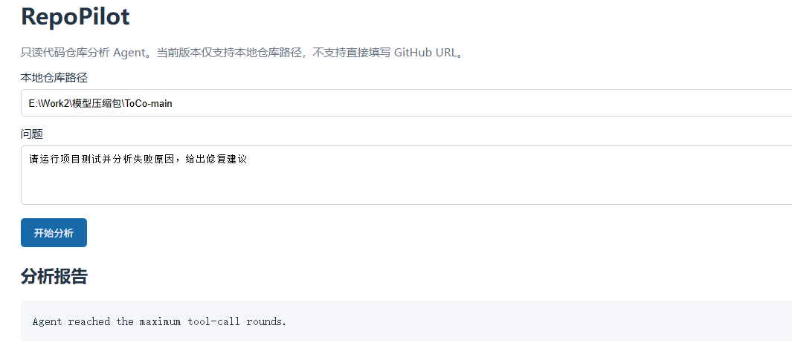

# RepoPilot

[](https://github.com/CX2002/repilot/actions/workflows/ci.yml)
[](https://www.python.org/)
[](LICENSE)

RepoPilot 是一个面向软件研发的只读代码仓库分析 Agent。它将自然语言问题转换为可追踪的仓库检索、测试执行和 Git 变更分析任务，并输出带文件路径/行号证据的报告。

> RepoPilot 不会自动修改代码；测试诊断失败后只输出建议性的修复提示，供开发者确认。

## 为什么做这个项目

阅读陌生仓库时，开发者通常需要反复切换目录、搜索代码、查看调用位置、运行测试和阅读 Diff。RepoPilot 将这些研发动作封装为可追踪的 Agent 工具调用，目标是缩短代码理解和问题定位时间，同时保留安全边界和可核验的代码证据。

## 能力

- 本地目录或公开 Git URL 分析（远程仓库自动浅克隆并清理）
- `list_files`、`search_code`、`read_file`、`find_symbol`、`run_tests`、`git_diff_summary` 工具
- OpenAI 兼容模型 Function Calling，多轮工具编排；无 API Key 时可离线回退
- README/源码/配置的轻量检索基线
- 基于 TF-IDF 向量的分块检索，保留 chunk 起止行号；可平滑替换为 Embedding 向量库
- 独立 MCP stdio Server，可供 Claude Desktop/Cursor 等 MCP 客户端调用
- 测试失败用例、错误类型、源码位置和建议提示
- Diff 文件、增删行统计和依赖/测试/配置风险信号
- 路径白名单、符号链接拦截、测试命令白名单、超时和结构化 Trace
- FastAPI、CLI、Docker Compose 和 GitHub Actions CI

## 架构

```text
用户问题 → RepoAgent → LLM/本地回退 → Tool Registry → Repository Sandbox
                                      ↓
                         检索 / 测试 / Diff / Trace
                                      ↓
                              结构化分析报告
```

## 快速开始

```bash
python -m venv .venv
source .venv/bin/activate       # Windows: .venv\\Scripts\\Activate.ps1
pip install -e .
uvicorn repilot.api:app --reload
```

打开 <http://127.0.0.1:8000/> 使用 Web 页面，或打开 <http://127.0.0.1:8000/docs> 调试 API。

## Web 页面预览



页面支持输入本地仓库路径或公开 Git URL，并分区展示分析报告、代码引用和工具 Trace。

请求示例：

```json
{"repository":"https://github.com/owner/project.git","question":"请运行项目测试并分析失败原因"}
```

也可以使用 CLI：

```bash
repilot /path/to/repository "登录功能在哪里实现？"
```

## API 调用

启动服务后调用 `POST /analyze`：

```bash
curl -X POST http://127.0.0.1:8000/analyze \
  -H "Content-Type: application/json" \
  -d '{"repository":"https://github.com/psf/requests.git","question":"HTTP 异常在哪里定义？请给出文件和行号"}'
```

返回值包含最终报告、引用和结构化 Trace：

```json
{
  "answer": "...",
  "citations": ["src/requests/exceptions.py:12"],
  "trace": [{"tool":"search_code","status":"ok","duration_ms":18.4}]
}
```

## 模型配置

```powershell
$env:REPILOT_API_KEY="your-key"
$env:REPILOT_BASE_URL="https://api.deepseek.com/v1"
$env:REPILOT_MODEL="deepseek-chat"
```

没有 API Key 时使用本地规则和词法检索模式，适合离线演示。配置模板见 `.env.example`。

## MCP Server

安装可选依赖并启动：

```bash
pip install -e ".[mcp]"
export REPILOT_MCP_REPOSITORY=/path/to/repository
repilot-mcp
```

MCP Server 只暴露只读仓库工具，使用 stdio 传输；不会暴露写文件能力。

## 安全边界

- 只读：没有写文件工具；远程仓库使用临时目录，分析后清理。
- 路径：拒绝目录穿越和符号链接，可通过 `REPILOT_ALLOWED_ROOTS` 限制目录白名单。
- 命令：只允许 `pytest`、`python -m pytest`、`go test`、`npm test`，使用 `shell=False`、超时和输出截断。
- Docker：仓库只读挂载、容器根文件系统只读，仅 `/tmp` 可写。
- Trace：记录工具、参数、状态、错误和耗时，便于审计和性能分析。

## 测试

运行项目自身测试：

```bash
pytest -q
```

## 项目定位与限制

RepoPilot 适合本地开发、团队内部代码问答和面试演示。当前 RAG 为无外部服务的词法检索，公开 Git URL 需要网络，私有仓库认证、真正的向量数据库和公网多租户鉴权尚未实现。

## License

MIT，见 [LICENSE](LICENSE)。
